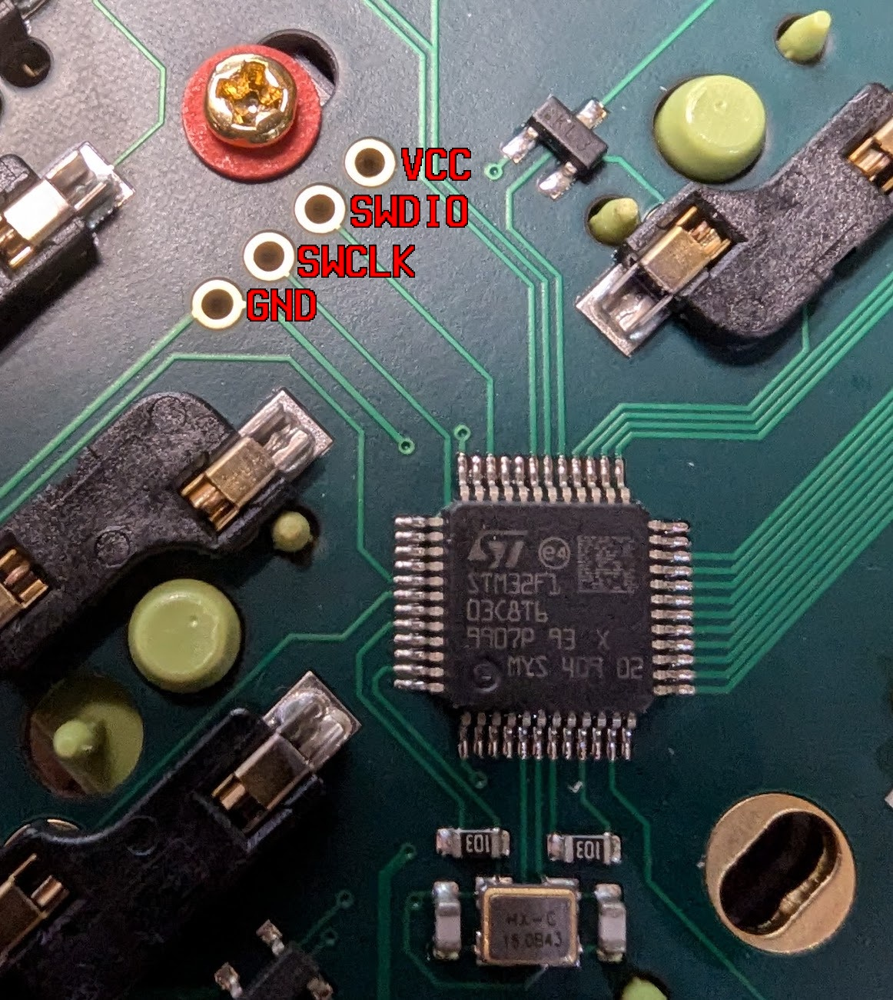

# Flashing bootloader

To be more specific, it means flashing the `stm32duino` bootloader.

## Why?

- The bootloader is corrupted, and the PCB can't boot anymore. Then, you have to flash the bootloader.
- The PCBs for sale may use either `tinyuf2` or `uf2boot` bootloaders, but for now, QMK firmware for this board is only compatible with the `stm32duino` bootloader. If you want to use the official QMK rather than the fork maintained by the designer, you should flash the bootloader.

## Required hardwares and softwares

Hardwares:

- ST-Link V2 Compatible Programmer & Emulator, which supports STM8/STM32. (For simplicity, this manual will refer to it as ST-Link from this point forward)

Softwares:

- bootloader, which is built from [its source code](../bootloader)
- [stlink](https://github.com/stlink-org/stlink)
- [openocd](https://openocd.org/)

## Wiring

Connect the pads on the board to the matching pins on the ST-Link.

Note: The USB on board shouldn't be connected.



> The pads is labeled by [@bartman](https://github.com/bartman)

## Checking

No jumpers on board are required to be set, because there aren't any at all.

Check that the ST-Link can talk to the board by running following command:

```console
$ st-info --probe
Found 1 stlink programmers
  version:    V2J46S7
  serial:     36FF6B063450373535131557
  flash:      65536 (pagesize: 1024)
  sram:       20480
  chipid:     0x0410
  dev-type:   STM32F1xx_MD
```

If the reported `chipid` is `0x0410`, everything is working. If it is `0x0000`, check your wiring, and try swapping the `SWDIO` and `SWCLK` pins, as some ST-Link may have incorrect pinouts.

## Flashing

Run the following command:

```console
$ st-flash --reset --format binary write <path/to/bootloader> 0x08000000
```

where <path/to/bootloader> is the path to the bootloader `.bin` file, which you have built from the bootloader's source code.

If all goes well, you should get output similar to the following:

```console
st-flash 1.8.0
2025-06-06T10:44:25 INFO common.c: STM32F1xx_MD: 20 KiB SRAM, 64 KiB flash in at least 1 KiB pages.
file ./generic-none_bootloader.bin md5 checksum: fff7649ef89ac799aa58a533deadc43, stlink checksum: 0x00093537
2025-06-06T10:44:25 INFO common_flash.c: Attempting to write 6976 (0x1b40) bytes to stm32 address: 134217728 (0x8000000)
-> Flash page at 0x8001800 erased (size: 0x400)
2025-06-06T10:44:25 INFO flash_loader.c: Starting Flash write for VL/F0/F3/F1_XL
2025-06-06T10:44:25 INFO flash_loader.c: Successfully loaded flash loader in sram
2025-06-06T10:44:25 INFO flash_loader.c: Clear DFSR
2025-06-06T10:44:25 INFO flash_loader.c: Clear CFSR
2025-06-06T10:44:25 INFO flash_loader.c: Clear HFSR
  7/7   pages written
2025-06-06T10:44:25 INFO common_flash.c: Starting verification of write complete
2025-06-06T10:44:25 INFO common_flash.c: Flash written and verified! jolly good!
2025-06-06T10:44:25 INFO common.c: NRST is not connected --> using software reset via AIRCR
```

Now, unplug the board from the ST-Link and connect it to USB, you'll see it appears in the OS's device tree.

It should now be ready to flash the QMK firmware.

## Troubleshooting

If you receive an `Unknown memory region` error, run the following command to unlock the STM32F103:

```console
$ openocd -f interface/stlink.cfg -f target/stm32f1x.cfg -c "init; reset halt; stm32f1x unlock 0; reset halt; exit"
```

Then, re-plug the ST-Link and try to flash again.

## References

- [ISP Flashing Guide#flashing-stm32duino-bootloader](https://github.com/qmk/qmk_firmware/blob/master/docs/isp_flashing_guide.md#flashing-stm32duino-bootloader) from QMK.
- [QMK Firmware - Issue 20982](https://github.com/qmk/qmk_firmware/issues/20982)
